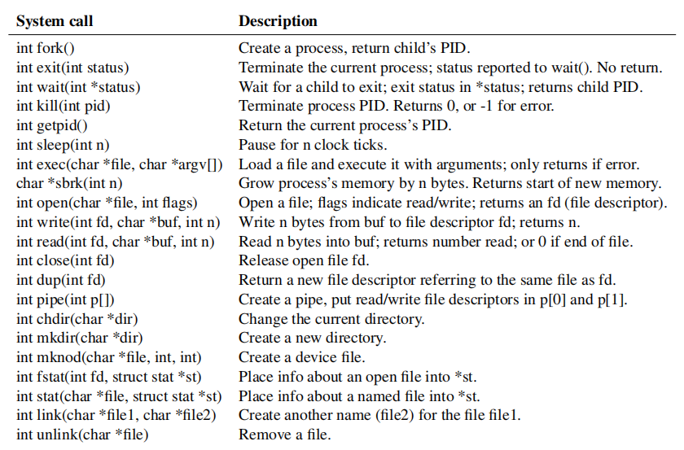

# 1. 操作系统接口

操作系统的任务，其一就是将一台计算机在多个程序之间共享，其二就是在计算机硬件提供的基本功能的基础上，为程序提供一系列有用的服务。操作系统对低层次的硬件进行管理和抽象，从而，例如一个单词的处理程序就不需要关注数据是存储在哪一种磁盘硬件上。操作系统在多个程序之间共享硬件，使得这些程序（看起来）能够同时运行。最后，操作系统提供一些程序间交互的方式，使得程序之间可以共享数据和协作。

操作系统通过接口来为用户程序提供服务。设计一个好的接口通常是很困难的。一方面，我们希望这个接口比较简洁，这样实现起来就更简单；另一方面，我们可能想要试图向应用程序提供一些复杂的功能。处理这种张力的技巧是，设计的接口要依赖于很少的基本机制，而这些基本机制可以组合起来提供很高的泛化性。

这本书用一个操作系统案例来展示操作系统的概念。 这个操作系统，xv6，提供了 Unix 操作系统（Ken Thompson 和 Dennis Ritchie）的基本接口，也同样模仿了 Unix 系统的内部实现。Unix 提供了一个简洁的接口，它们所依赖的机制就能够很好的结合，达到惊人的泛化性。这一接口已经被成功的应用于现代操作系统：BSD, Linux, macOS, Solaris, 甚至是 MS Windows，它们都具有 Unix-like 的接口。要理解这些操作系统的任何一个，先理解 xv6 都是一个良好的开始。

如图 1.1 所示，xv6 采取了传统的内核（kernel）形式。内核是一个特殊的程序，用来运行其他的程序。每一个由内核运行的程序，称为一个进程（process）。每个进程都具有一些内存，包括这个程序的指令、数据和运行时栈。其中，指令是这个程序的计算实现，数据这些实现所要操作的变量，而运行时栈组织了程序的过程调用。一个计算机通常有许多个进程，但是只有一个内核。

*图 1.1：内核和两个用户进程*

当一个进程需要调用一项内核服务时，它就发起一次系统调用（system call），也就是操作系统提供的诸多接口中的一个。系统调用会陷入内核，内核完成这项服务后再返回到进程。这样，一个进程的运行过程就是再用户态（user space）和内核态（kernel space）之间切换。

内核使用 CPU 硬件保护机制来确保每个进程都在它自己的用户态中运行，而且也只能访问它自己的内存。内核运行时具有访问硬件的特权，从而可以实现这些保护机制；而用户程序则没有这些特权。当用户程序发起一次系统调用，内核会开始运行一段预先安排的函数，来提升对硬件的控制等级。

内核提供的接口集合就是用户程序课件的系统调用。xv6 内核提供了传统 Unix 内核的系统调用的一个子集。图 1.2 列出了 xv6 的所有系统调用。

*图 1.2：xv6 的系统调用。除非另外说明，这些系统调用返回 0 表示正常，返回 -1 表示异常。*

这一章会分别介绍 xv6 提供的各项服务——进程，内存，文件描述符，管道和文件系统。并且，利用代码段来解释 Shell （Unix 的命令行用户接口）是如何利用这些基本接口的。Shell 对于这些系统调用的使用也说明了这些调用应该如何被谨慎地设计。