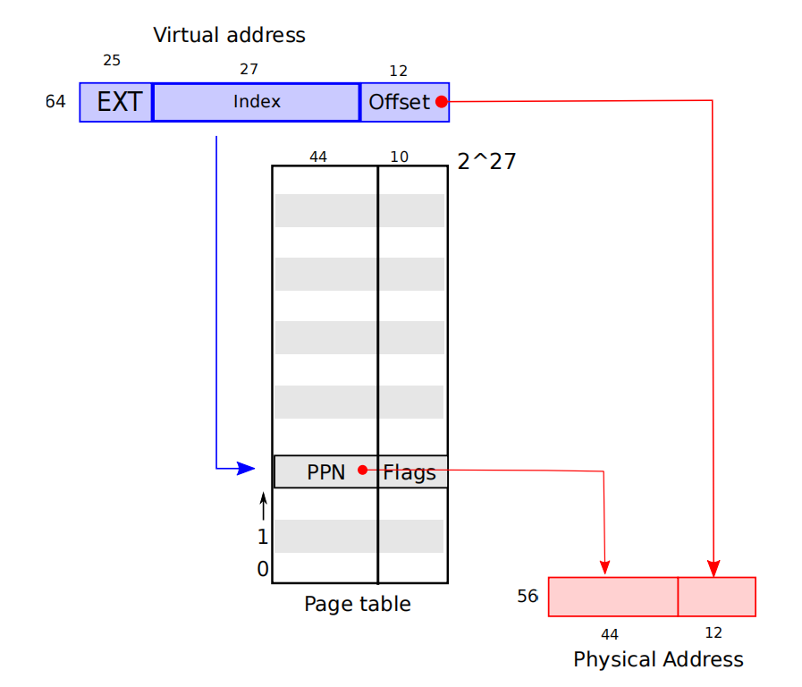
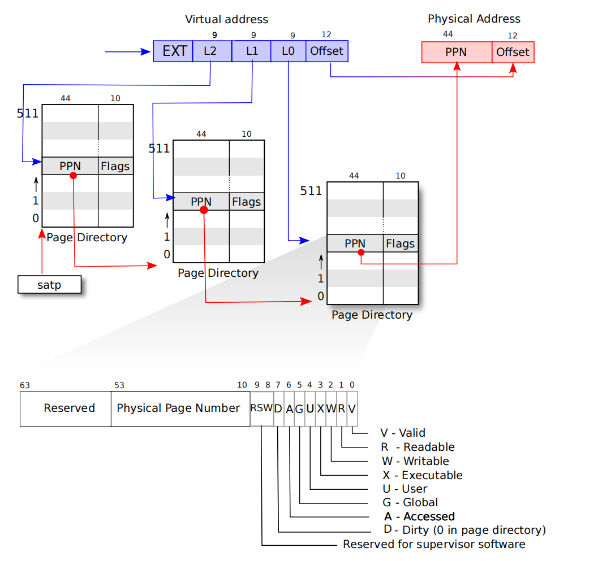

首先要明确的是，RISC-V 的指令（无论内核态还是用户态）都是操作虚拟地址的。而机器的物理内存，是以物理地址索引的。RISC-V 硬件页表通过将每个虚拟地址映射到一个物理地址，从而将这两者关联起来。

xv6 在 Sv39 RISC-V 上运行，这意味着 64 位虚拟地址中只有低 39 位被真正使用。在这一 Sv39 配置下，RISC-V 的页表逻辑上是 $2^{27}(134,217,728)$ 个页表项（page table entries, PTEs）。每个页表项包含了一个 44 位的物理页号（physical page number, PPN）和一些标志位。在进行翻译时，硬件页表使用 39 位中的高 27 位来索引到一个 PTE。这样，剩下的 12 位虚拟地址加上 PTE 中的 44 位就组合成一个 56 位的物理地址。图 3.1 展示了这个过程：逻辑上硬件页表就是 PTE 的序列。图 3.2 详细描述了这个过程。利用页表，操作系统可以在对齐的 4096 字节（$2^{12}$）的粒度上控制虚拟地址到物理地址的翻译。这也就是一个页。

*图 3.1：RISC-V 的虚拟和物理地址，以及简化的逻辑页表*

在 Sv39 RISC-V 中，虚拟地址的高 25 位没有被用作翻译。而且，PTE 格式中的 PPN 还有 10 位的增长空间（PTE 可用 8字节，64位，上述的设计中 PTE 占据 54 位），所以最终的物理地址也还有 10 位的增长空间。RISC-V 的设计者选择这些数字是处于技术上的考量。虚拟地址空间为 $2^{39}$ 字节，也就是 512 GB，这对于应用程序来说应该足够了。 $2^{56}$ 字节的物理地址空间，对于可预见的未来的读写设备和硬盘也都足够了。如果需要更多，RISC-V 设计者也已经定义了带有 48 位虚拟地址的 Sv48。

图 3.2 展示了 RISC-V CPU 将虚拟地址翻译为物理地址的三步。页表在物理内存中是以树形分三层存放的。树的根部是一个 4096 字节的页表页，包含了 512 个 PTE。每个 PTE 记录了树中下一级页表页的物理地址。类似的，第二级页表中的每个 PTE 记录了最低级页表页的物理地址。在利用虚拟地址的高 27 位索引最低级页表页时，会进行分层索引。先用高 9 位（$512=2^9$）索引树根页表页，找到第二级页表页的地址；然后用次高 9 位索引第二级页表页，找到最低级页表页的地址；然后用低 9 位索引最低级页表页，找到实际存放数据的页的地址。（在 Sv48 中页表具有 4 级，来索引 $2^{39}$ 个 PTE）。

*图 3.2：RISC-V 地址翻译*

所以，翻译过程需要查看 3 个 PTE。如果其中任意一个不存在，分页硬件就会抛出页错误异常（page-fault exception），让内核来处理这个异常。

图 3.2 所示的三级结构与图 3.1 所示的单级结构相比，是一种更加内存高效的 PTE 存储方式。在通常的情况下，大多数虚拟地址都没有被映射，那么三级结构就可以忽略许多个页表项。例如，如果一个应用只使用了开始于 0 地址处的几个页，那么顶级页表页中的 511 个 PTE 都是无效的，只有 1 个 PTE 是有效的。那么内核就不用为这 511 个 PTE 浪费空间去存储更多的页表页。总共节省的空间是 $511 \times 512$ 个页。

对于 加载/存储 指令，CPU 确实是按照这个三级结构运行的。弊端在于，CPU 必须从内存中加载 3 个 PTE 才能完成翻译，从而完成一条 加载/存储 指令。为了降低从物理内存中加载 PTE 的开销，RISC-V CPU 使用了 PTE 缓存，也就是 TLB（Translation Look-aside Buffer）。

每个 PTE 都包含一些标记位，来告知分页硬件相关的地址的使用权限。`PTE_V` 表示这个 PTE 是否存在，如果没有设置这一位，视图引用这一个 PTE 时就会导致异常。`PTE_R`，`PTE_W`，`PTE_X` 分别控制能否从这一页中读，写，以及将数据解读为指令并执行。`PTE_U` 控制用户态的指令能够获取这一页，如果没有设置，这一页就只在特权模式下可见。图 3.2 展示了它的工作方式。所有标记位以及其他相关的分页硬件结构都在  [kernel/riscv.h](https://github.com/mit-pdos/xv6-riscv/blob/riscv//kernel/riscv.h) 中定义了。

为了告诉硬件如何使用页表，内核需要将根页表页的物理地址写入 `satp` 寄存器。每个 CPU 都具有自己的 `satp` 寄存器。CPU 在翻译地址时，会首先使用它自己的 `satp` 寄存器指向的页表。这样，不同的 CPU 可以运行不同的进程，并且每个 CPU 进程都具有一个由自己的页表描述的私有地址空间。

通常来说，内核把所有的物理内存都映射到页表中，从而它可以通过 load / store 指令读写任何位置的物理内存。由于页表本身也是存储在物理内存中的，内核也可以使用 store 指令对 PTE 本身进行写入，从而对 PTE 的内容进行编程。

这里厘清一下概念：物理内存指的是 DRAM 中的存储单元。物理内存中的一个字节具有一个物理地址。指令使用的是虚拟地址。虚拟地址由分页硬件翻译成物理地址，然后发送到 DRAM 硬件进行读写操作。不同于物理内存和虚拟地址，虚拟内存不是真实存在的东西，而是指内核用来管理物理内存和虚拟地址的一套机制和抽象。

